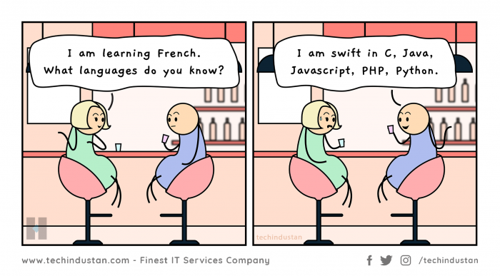

<!--MarkDown Comment-->
Mofijul Islam <!--To initiate a new line, just press 2 spaces after a line-->  
This is Second Line
### Horaizontal Line:
---

</br>

### Headings:  
# Mofijul Islam    
## Mofijul Islam
### Mofijul Islam
#### Mofijul Islam
##### Mofijul Islam
###### Mofijul Islam   

</br>

### Paragraph:
<p>
This is a pargraph line 1. This is the paragraph line2. This is the paragraph line3. This is the paragraph line 4. This is the paragraph line 5.
</p>
</br>

### Italic Text:
<i>This an Italic text.</i>  
_This is anoter Italic text_

</br>

### Strong or Bold Text:
__Stron/Bold Text__

</br>

### Strike Through:
<del>This is an Strike Throug</del>   
~~This is the second way of Strike Through~~  

</br>


### Single Line Block Element:
`Single inline Code Block`  
`<h1>Another Single inline code Block</h1>` 

</br>


### Multiple Line Block Element:
```
<h2>Multiple Inline code block</h2>
<h3>Second Line of multiple Inline Code block</h3>
<p>Third Line of multiple inline code block</p>
``` 
```html
<h2>Multiple Inline code block</h2>
<h3>Second Line of multiple Inline Code block</h3>
<p>Third Line of multiple inline code block</p>
``` 
```javascript

consle.log("Hello World!");
``` 
```css
head{
    background-color:green;
}
``` 

</br>  

### Ordered List:  
1. Item1
2. Item2
    1. Item 2.1
    2. Item 2.2
3. Item3

</br>

### Unordered List:  
- Item1
- Item2
    1. item2.1
    2. item2.2
- Item3
    - item3.1
    - item3.2

</br>

### Task List: 
- [x] Task1
- [x] Task2
- [x] Task3

</br>

### Automatic Link:  
http://www.studywithanis.com

### Disable Link:  
`http://www.studywithanis.com`

### Markdown Link Syntex:
[StudyWithAnis](http://www.studywithanis.com) 

### Using Multiple Link in a context:
Click To Learn : [C#][DevSkill]  
Click To Learn : [Competative Programming][DevSkill]  
Click To Learn : [Total Web Development][ProgrammingHero]  
Click To Learn : [Redux][LearnWithSumit]  


<!--All Links are here-->
[DevSkill]: https://devskill.com/  
[ProgrammingHero]: https://www.programming-hero.com/  
[LearnWithSumit]: https://learnwithsumit.com/

</br>

### Image Syntex:
<!---->


### Image Syntex Using HTML:


</br>

### Using emoji:
__Just Copy Paste from Emoji Media__  
😎  
😈  

</br>

### Using Table:  
| Name | Email |  
| ---- | ---- |
|Emon | emonmbs@gamil.com|
|Fahim | fahimbhotka@gmail.com|


